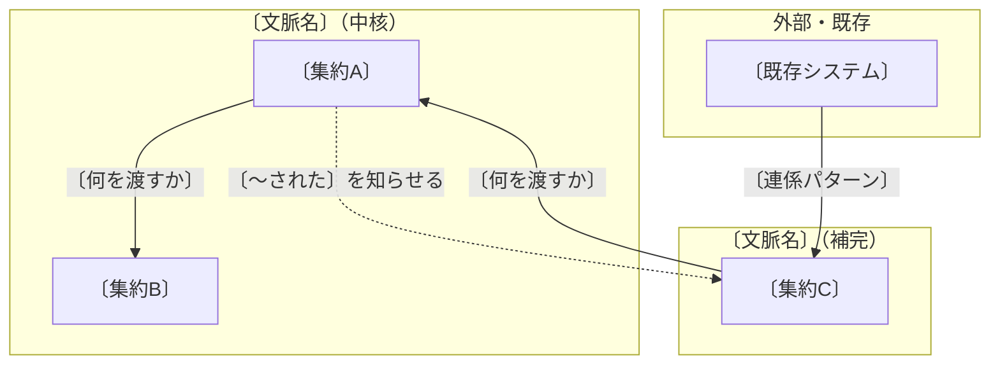

# 〔システム名〕の設計の土台

〔誰が、何のために、何をするシステムかを 1 文で言い切る〕

## 1. 全体像

### 1.1 どんなオブジェクトができて、どうつながるか

矢印は上流から下流へ、材料が流れる向きに引く。実線は材料を渡す（下流が上流を ID で参照する）、点線は出来事を知らせる。

図の読み方を 2〜3 行で書く。どこが中心で、何が起きると何に伝わるか。箱の外枠は区切られた文脈（Bounded Context）、中の箱は集約（Aggregate）のルート、と初出でここに書く。

### 1.2 中核の業務領域とそれ以外

| 業務領域 | 種類 | 一言の理由 | 方針 |
|---|---|---|---|
| 〔領域〕 | 中核 | 〔競合との差になる点〕 | 自前で作り込む |
| 〔領域〕 | 一般 | 〔既製品で済む理由〕 | 既製品・外部サービス |
| 〔領域〕 | 補完 | 〔無いと困るが差にならない理由〕 | 素直に作る |

### 1.3 必要な機能（抽象）

| 機能 | 中身の例 | どの文脈 | 作る／既製品／後回し |
|---|---|---|---|
| 〔ログイン機能〕 | 〔SSO、権限〕 | 〔文脈〕 | 既製品 |
| 〔決済機能〕 | | | |

## 2. 詳細（仮）

### 2.1 同じ言葉

意味が 2 つある言葉を先に書く。ここが文脈を分けた根拠になる。

| 言葉 | 意味A | 意味B | どう分けたか |
|---|---|---|---|

主な用語（10 個以内）。

| 用語 | 意味（日常語） |
|---|---|

### 2.2 必要な動作（業務イベント・コマンド・登場人物・外部システム・ポリシー）

イベントストーミングの机上版。業務イベントは過去形、コマンドは「〜する」、ポリシーは「〜されたら〜する」で書く。

| 種類 | 名前 | 誰が起こすか | 何が変わるか |
|---|---|---|---|
| 登場人物 | | | |
| 外部システム | | 入力側／出力側 | |
| コマンド | | | |
| 業務イベント | | | |
| ポリシー | 〔〜されたら、〜する〕 | | |

### 2.3 区切られた文脈どうしのつながり方

| 利用者側 | 供給者側 | 連係パターン（日本語／原語） | 一言の理由 |
|---|---|---|---|

### 2.4 集約と守る決まり

| 集約（ルート） | 中に持つもの | 守る決まり | 起こす出来事 | 他集約への参照（ID） |
|---|---|---|---|---|

### 2.5 テーブルの当たり（仮）

集約 1 つにつき 1〜2 テーブルの当たりを付ける。列は最低限。詳細は決めない。

| テーブル | 主キー | 最低限の列 | 最低限考慮すること |
|---|---|---|---|
| 〔名前〕 | 〔ID〕 | 〔状態、金額、日時 など〕 | 〔一意制約、履歴を残すか、削除は論理か、他システムのIDを持つか〕 |

### 2.6 実装方式

| 文脈 | 実装方式 | 一言の理由 |
|---|---|---|

### 2.7 デザインパターン（逆引き表の 11 パターンから、最大 3 件）

| パターン | 当てる場所 | 要件文の言い回し | 迷った隣と選ばなかった理由 | 出典（URL 全文） |
|---|---|---|---|---|
| 〔State〕 | | 「〔引用〕」 | | https://www.techscore.com/tech/DesignPattern/State.html |

該当なしなら「該当なし」と 1 行で書く。

## 3. 決めてもらうこと（最大 8 個）

答えで上の図や表が変わるものだけ。順番は影響が大きい順。

1. 〔質問〕。分かると〔何〕が確定する
